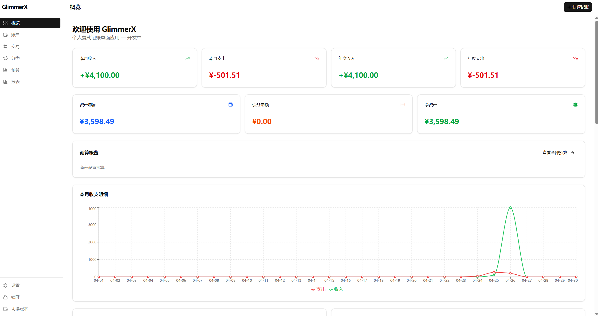

# GlimmerX

一款跨平台个人复式记账桌面应用。

**核心理念**: 本地优先、数据私有、复式记账、简洁高效。

## 预览



## 功能特性

### 已实现功能

- **账户管理** — 多账户类型（资产、负债、收入、支出）、账户余额追踪、账户归档
- **交易管理** — 复式记账交易、快速记账（支出/收入/转账）、交易搜索与过滤
- **分类管理** — 层级分类结构、分类统计
- **预算管理** — 月度/年度预算、预算执行报告
- **概览仪表盘** — 月度/年度收支汇总、净资产趋势、分类占比、近期交易
- **报表分析** — 9 种报表（标准财务报表、分类分析、资产负债表、收支趋势、月度对比、年度汇总、账户交易、账户余额趋势、审计报告）
- **数据管理** — 数据库备份、CSV 导出、Beancount 导出
- **国际化** — 中文、英文双语支持

### 待实现功能

- CSV 导入交易数据

## 技术栈

| 层级 | 技术 |
|------|------|
| 框架 | Tauri 2 + React 19 |
| 语言 | TypeScript 5.8 + Rust |
| UI | shadcn/ui + Tailwind CSS 4 |
| 数据库 | SQLCipher（加密 SQLite） |
| 状态管理 | Zustand + React Query |
| 图表 | Recharts |
| 国际化 | i18next |

## 开发方式

本项目由 **OpenCode + GLM-5** 完全驱动开发，实现 **100% AI 生成代码**。

- 所有源代码、设计文档、配置文件均由 AI 编写
- 零手动修改 — 人类仅提供需求、审查输出、做出决策
- AI 负责完整的软件工程流程：需求分析、架构设计、编码实现、调试修复、测试编写

这是对 AI 辅助软件开发能力的实际验证项目。

## 项目结构

```
GlimmerX/
├── src/                  # React 前端源码
│   ├── components/       # UI 组件（按功能模块组织）
│   ├── pages/            # 页面组件
│   ├── hooks/            # React Query hooks
│   ├── utils/            # 工具函数（API、日期、格式化）
│   ├── stores/           # Zustand stores
│   └── i18n/             # 国际化配置
├── src-tauri/            # Rust 后端源码
│   ├── src/
│   │   ├── db/           # 数据库层（账户、交易、分类等）
│   │   ├── commands/     # Tauri 命令处理
│   │   └── utils/        # 工具模块
│   └── capabilities/     # Tauri 权限配置
├── design/               # 设计文档（详细设计）
├── docs/                 # 文档资源（截图等）
├── public/               # 静态资源
└── hooks/                # Git hooks
```

## 快速开始

### 环境要求

- Node.js 18+
- Rust 1.70+
- 系统依赖（见下方平台说明）

### 安装与运行

```bash
# 安装依赖
make setup

# 开发模式（桌面应用 + HMR）
make dev

# 仅前端（浏览器调试）
make dev-web
```

### 平台依赖

**Windows**: 运行 `setup-windows.ps1` 自动安装依赖
**Ubuntu**: 运行 `setup-ubuntu.sh` 自动安装依赖

## 开发命令

```bash
make help          # 查看所有命令
make dev           # 开发模式
make check         # 完整检查（tsc + eslint + prettier + cargo fmt + clippy）
make lint          # 代码检查
make fmt           # 格式化代码
make test          # 运行测试
```

## 构建发布

```bash
make release           # 当前平台安装版
make release-windows   # Windows: NSIS + MSI + MSIX
make release-linux     # Linux: AppImage + deb + rpm
make release-mac       # macOS: dmg + app

make portable          # 便携版（当前平台）
make portable-windows  # Windows 单文件 exe
make portable-linux    # Linux AppImage
```

输出目录: `release/`

## 设计文档

详细设计文档位于 `design/` 目录，索引见 [DESIGN.md](DESIGN.md)。

关键文档:

- [01-overview.md](design/01-overview.md) — 项目概述、技术栈、项目边界
- [03-concepts.md](design/03-concepts.md) — 复式记账模型、账户体系
- [05-data-model.md](design/05-data-model.md) — SQL 表结构、TypeScript 类型
- [14-transaction-module.md](design/14-transaction-module.md) — 交易模块架构

## 推荐 IDE

- [VS Code](https://code.visualstudio.com/)
- [Tauri 扩展](https://marketplace.visualstudio.com/items?itemName=tauri-apps.tauri-vscode)
- [rust-analyzer](https://marketplace.visualstudio.com/items?itemName=rust-lang.rust-analyzer)

## 许可证

**非商业许可 — 个人免费使用**

- 个人用户可免费使用、修改和分发本软件
- 禁止商业用途（包括但不限于销售、捆绑销售、企业内部使用）
- 详见 [LICENSE](LICENSE) 文件
# GlimmerX
