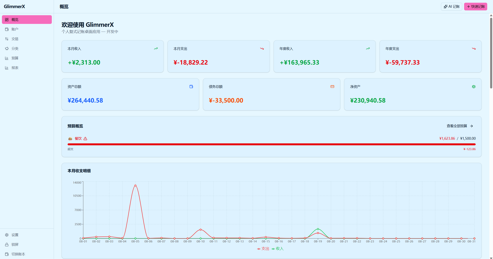

# GlimmerX

一款跨平台个人复式记账桌面应用。

**核心理念**: 本地优先、数据私有、复式记账、简洁高效。

## 预览



## 功能特性

### 已实现功能

- **账户管理** — 多账户类型（资产、负债、收入、支出）、账户余额追踪、账户归档
- **交易管理** — 复式记账交易、快速记账（支出/收入/转账）、交易搜索与过滤
- **AI 记账** — 自然语言录入交易（如"中午吃饭18元"），自动识别分类/账户/金额/日期，支持 OpenAI / DeepSeek / Ollama 等兼容服务
- **分类管理** — 层级分类结构、分类统计
- **预算管理** — 月度/年度预算、预算执行报告
- **概览仪表盘** — 月度/年度收支汇总、净资产趋势、分类占比、近期交易
- **报表分析** — 9 种报表（标准财务报表、分类分析、资产负债表、收支趋势、月度对比、年度汇总、账户交易、账户余额趋势、审计报告）
- **数据管理** — 数据库备份、CSV 导出/导入（含去重）、Beancount 导出
- **国际化** — 中文、英文双语支持

## 技术栈

| 层级     | 技术                       |
| -------- | -------------------------- |
| 框架     | Tauri 2 + React 19         |
| 语言     | TypeScript 5.8 + Rust      |
| UI       | shadcn/ui + Tailwind CSS 4 |
| 数据库   | SQLCipher（加密 SQLite）   |
| 状态管理 | Zustand + React Query      |
| 图表     | Recharts                   |
| 国际化   | i18next                    |

## 开发方式

本项目由 **OpenCode + GLM-5** 完全驱动开发，实现 **100% AI 生成代码**。

- 所有源代码、设计文档、配置文件均由 AI 编写
- 零手动修改 — 人类仅提供需求、审查输出、做出决策
- AI 负责完整的软件工程流程：需求分析、架构设计、编码实现、调试修复、测试编写

这是对 AI 辅助软件开发能力的实际验证项目。

## 项目结构

```
GlimmerX/
├── src/                  # React 前端源码
│   ├── components/       # UI 组件（按功能模块组织）
│   ├── pages/            # 页面组件
│   ├── hooks/            # React Query hooks
│   ├── utils/            # 工具函数（API、日期、格式化）
│   ├── stores/           # Zustand stores
│   └── i18n/             # 国际化配置
├── src-tauri/            # Rust 后端源码
│   ├── src/
│   │   ├── db/           # 数据库层（账户、交易、分类、设置等）
│   │   ├── commands/     # Tauri 命令处理
│   │   ├── services/     # 业务服务层（AI 解析等）
│   │   └── utils/        # 工具模块
│   └── capabilities/     # Tauri 权限配置
├── design/               # 设计文档（详细设计）
├── docs/                 # 文档资源（截图等）
├── public/               # 静态资源
└── hooks/                # Git hooks
```

## 快速开始

### 环境要求

- Node.js 18+
- Rust 1.70+
- 系统依赖（见下方平台说明）

### 安装与运行

```bash
# 安装依赖
make setup

# 开发模式（桌面应用 + HMR）
make dev

# 仅前端（浏览器调试）
make dev-web
```

### 平台依赖

**Windows**: 运行 `setup-windows.ps1` 自动安装依赖
**Ubuntu**: 运行 `setup-ubuntu.sh` 自动安装依赖

## 开发命令

```bash
make help          # 查看所有命令
make dev           # 开发模式
make check         # 完整检查（tsc + eslint + prettier + cargo fmt + clippy）
make lint          # 代码检查
make fmt           # 格式化代码
make test          # 运行测试
```

## 构建发布

```bash
make release           # 当前平台安装版
make release-windows   # Windows: NSIS + MSI + MSIX
make release-linux     # Linux: AppImage + deb + rpm
make release-mac       # macOS: dmg + app

make portable          # 便携版（当前平台）
make portable-windows  # Windows 单文件 exe
make portable-linux    # Linux AppImage
```

输出目录: `release/`

## AI 记账

通过自然语言快速录入交易，无需手动填写金额、分类、账户等字段。

### 使用方式

1. **配置 AI 服务** — 打开「设置」页，在「AI 记账」区块选择服务商并填写配置：
   - **OpenAI** — Base URL `https://api.openai.com/v1`，填写 API Key 和模型名（如 `gpt-4o-mini`）
   - **DeepSeek** — Base URL `https://api.deepseek.com/v1`，填写 API Key 和模型名（如 `deepseek-chat`）
   - **Ollama（本地）** — Base URL `http://localhost:11434/v1`，API Key 可留空，填写本地模型名（如 `llama3.1`）
   - **自定义** — 任何兼容 OpenAI Chat Completions 协议的服务
   - **默认支出账户** — 当 AI 无法从文本推断来源账户时使用的兜底账户
2. **打开 AI 对话框** — 点击顶部栏的 ✨ 按钮，或使用快捷键 `Ctrl+Shift+I`（macOS: `Cmd+Shift+I`）
3. **输入自然语言** — 如 `中午吃饭18元`、`昨天工资到账8000`、`微信付打车15块`
4. **自动录入** — AI 解析后自动创建交易，无需手动确认

### 工作原理

```
用户输入 "昨天午饭15块 微信付的"
  ↓
Rust 后端构造英文 prompt（注入当前日期/分类清单/账户清单）
  ↓
调用 OpenAI 兼容 /chat/completions API（JSON mode，不支持时自动降级）
  ↓
解析 JSON → 校验金额/日期/类型 → 匹配或自动创建分类 → 推断账户
  ↓
复用 quick_add_transaction 生成平衡双分录 → 写入数据库
```

- **隐私**：API Key 存储在本地加密数据库中，不经过前端 webview
- **兜底**：后端严格校验 AI 返回数据，任何字段异常都会报错且不录入
- **分类自动创建**：AI 识别的分类在现有分类中找不到时自动新建

## 设计文档

详细设计文档位于 `design/` 目录，索引见 [DESIGN.md](DESIGN.md)。

关键文档:

- [01-overview.md](design/01-overview.md) — 项目概述、技术栈、项目边界
- [03-concepts.md](design/03-concepts.md) — 复式记账模型、账户体系
- [05-data-model.md](design/05-data-model.md) — SQL 表结构、TypeScript 类型
- [14-transaction-module.md](design/14-transaction-module.md) — 交易模块架构

## 推荐 IDE

- [VS Code](https://code.visualstudio.com/)
- [Tauri 扩展](https://marketplace.visualstudio.com/items?itemName=tauri-apps.tauri-vscode)
- [rust-analyzer](https://marketplace.visualstudio.com/items?itemName=rust-lang.rust-analyzer)

## 许可证

**GNU General Public License v3.0**

- 个人和商业均可免费使用、修改本软件
- 修改后的版本分发时必须以 GPL v3 发布（开源）
- 此机制防止商业闭源二次售卖
- 详见 [LICENSE](LICENSE) 文件

# GlimmerX
